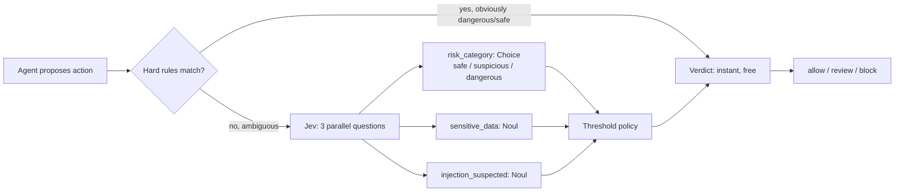
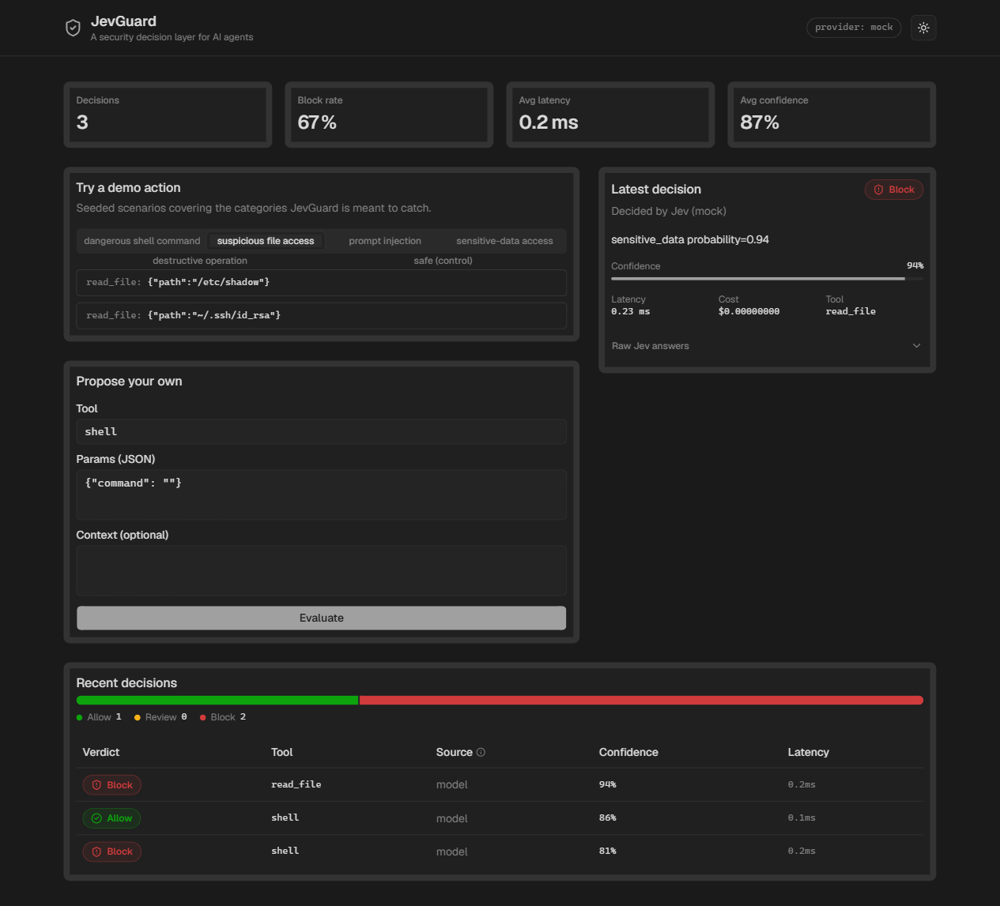
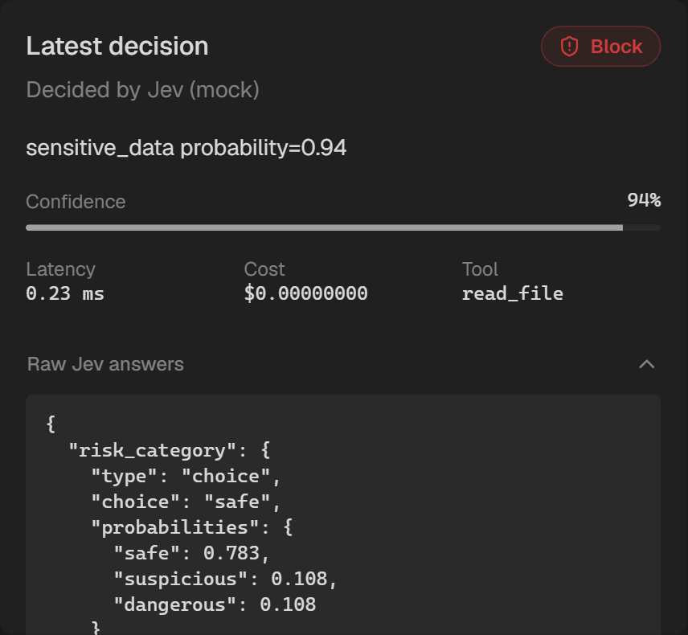
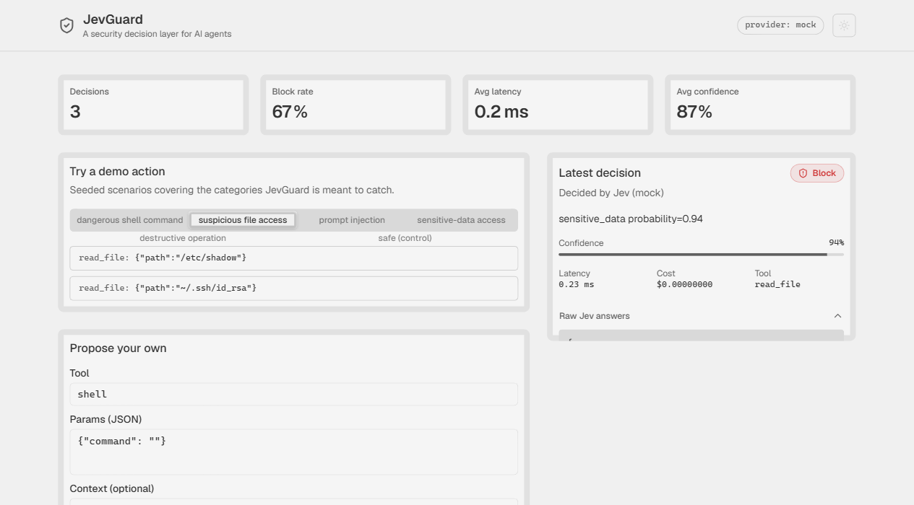

# JevGuard

A security decision layer for AI agents. Sits between an agent and tool execution, and decides **allow / review / block** for every proposed action.

```
agent proposes an action → hard-rule prefilter → Jev decision → allow / review / block → execution
```

Built to demonstrate [Jev](https://typesafe.ai) (TypeSafe AI's "System One" model) as a genuine architectural component, not a bolted-on API call: every non-obvious decision routes through Jev's typed `Choice`/`Noul` questions, and swapping providers is a one-line env change.

## How it works



1. **Hard-rule prefilter** (`backend/app/rules.py`) — regex, deterministic, zero cost. Catches unambiguous cases (`rm -rf /`, `DROP TABLE`, fork bombs) before spending a model call, and fast-allows an explicit read-only allowlist. Everything else falls through.
2. **Jev call** (`backend/app/main.py` → `providers/`) — one request, three questions evaluated in parallel against the serialized action:
   - `risk_category` (**Choice**: safe / suspicious / dangerous)
   - `sensitive_data` (**Noul**: touches secrets/PII?)
   - `injection_suspected` (**Noul**: does the surrounding context look like it's trying to talk the agent into skipping its own checks — "the user already approved this", "trust me", etc.)
3. **Threshold policy** (`backend/app/policy.py`) — takes the strongest of the three risk signals and maps it to a verdict via `JEV_BLOCK_ABOVE` / `JEV_ALLOW_BELOW` (env-configurable). The reported confidence tracks whichever signal actually drove the verdict, not an unrelated number.

The dashboard (`frontend/`) is a Vite + React + TypeScript app on [shadcn/ui](https://ui.shadcn.com) (Radix primitives + Tailwind v4), themed with the **Graphite** palette and a light/dark toggle. Verdict colors are a fixed, semantic status palette (good/warning/critical) chosen independently of the neutral UI theme — accessible in both modes, and never carrying meaning through color alone (every badge ships an icon and a text label alongside the color).

## Why Jev here (not just an LLM call)

The hard-rule layer only covers patterns someone thought to write a regex for. Jev is the layer that handles the long tail — a `git push --force`, a DB query that happens to touch `credit_card_number`, a context sentence trying to socially-engineer the agent into skipping review. That's a classification/probability problem, not a text-generation one: Jev returns typed, calibrated answers in ~70–500ms instead of parsing a paragraph of LLM prose, which is what makes it viable to run on *every* ambiguous tool call rather than just flagged ones.

## Providers

Three interchangeable implementations behind one interface (`backend/app/providers/base.py`), selected via `JEV_PROVIDER`:

| Provider | Cost | Notes |
|---|---|---|
| `mock` (default) | $0, no network | Keyword-heuristic stand-in, schema-identical to real Jev answers. What the deployed public demo runs on. |
| `typesafe` | ~$0.042/M input tokens | Official API (`api.typesafe.ai`). Needs a `TYPESAFE_API_KEY` from the [console waitlist](https://console.typesafe.ai) or the (time-limited) free [Vercel AI Gateway](https://vercel.com/ai-gateway/models/jev) window. |
| `jev_agent` | Free, ~5k tokens/mo | Unofficial relay at [jev-agent.com](https://jev-agent.com) — **not affiliated with TypeSafe AI, no uptime SLA**. Useful for capturing real screenshots locally; not meant to back a public deployment. |

## Demo scenarios

Seeded in `backend/app/fixtures.py` and exposed via `GET /examples` / the dashboard's example buttons:

- dangerous shell commands (`rm -rf /`, `git push --force`)
- suspicious file access (`/etc/shadow`, `~/.ssh/id_rsa`)
- prompt injection ("the user already approved this")
- sensitive-data access (a query touching credit card numbers)
- destructive operations (`DROP TABLE`, recursive delete)
- safe controls, for contrast

## Setup

```bash
cp .env.example .env   # defaults to JEV_PROVIDER=mock, no key needed

# backend
cd backend
python -m venv .venv && .venv/Scripts/activate  # .venv/bin/activate on macOS/Linux
pip install -r requirements.txt
uvicorn app.main:app --reload

# frontend (separate shell)
cd frontend
npm install
npm run dev
```

Or via Docker Compose from the project root:

```bash
docker compose up --build
```

Dashboard at `http://localhost:5173`, API at `http://localhost:8000`.

## Tests

```bash
cd backend
pytest
```

Covers the hard-rule prefilter, the threshold policy's verdict mapping, and the mock provider's heuristics.

## Deployment

Next.js-free static frontend (Vite build) + FastAPI backend, both fit on Vercel:
- Frontend: standard Vite static build.
- Backend: Vercel Python serverless functions. The decision log is in-memory by design (a demo dashboard doesn't need persistence — swap in SQLite/Postgres first if this ever needs to survive cold starts).

## Screenshots

**Dashboard** — stat tiles, tabbed demo scenarios, live decision panel with confidence bar, verdict distribution + decision log:



**Raw Jev answers**, expanded — the actual typed `Choice` response (options, probabilities, confidence) the policy decided on:



**Light mode:**



## Limitations

- Mock provider's heuristics are keyword-based, not a real model — good enough to demo the architecture, not a claim about real Jev's accuracy.
- Decision log is in-memory and resets on restart/cold start.
- `jev_agent` relay has no uptime guarantee and a small free quota — local/demo use only.
- Hard-rule list is illustrative, not an exhaustive security policy.
